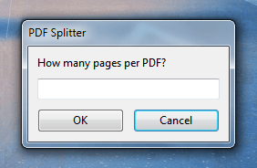

# AHK-Utils

This repository contains various AHK classes and functions I find useful.

## [GuiPrompt.ahk](Lib/GuiPrompt.ahk)

Creates a basic, self-contained prompt. A prettier alternative to the native `InputBox`.

API

```ahk
prompt := new GuiPrompt({ promptTitle: "PDF Splitter" })
prompt.AddInput({ textLabel: "How many pages per PDF?"
  , variable: "amountInput" })

inputResult := prompt.Show()

if (inputResult) {
  msgBox % inputResult["amountInput"]
} else {
  msgBox % "User canceled"
}
```

Result



## [CmdLine.ahk](Lib/CmdLine.ahk)

Basic util class for working with big and dynamic command line calls.

```ahk
inputFile := "../myfile.mp4"
outputFile := "../cut_myfile.mp4"
fromTime := "00:10"
toTime := "00:31"

cmd := new CmdLine("ffmpeg.exe")

cmd.AddParam("-ss", fromTime)
cmd.AddParam("-i", inputFile)

cmd.AddParam("-c", "copy")
cmd.AddFlag("-copyts")

cmd.AddParam("-to", toTime)

cmd.AddFlag(outputFile)
cmd.Execute()
```
